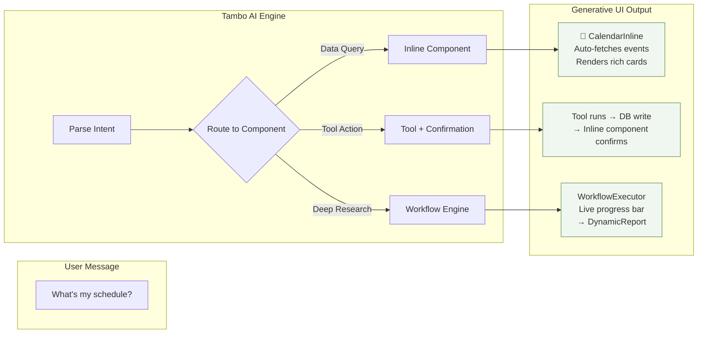
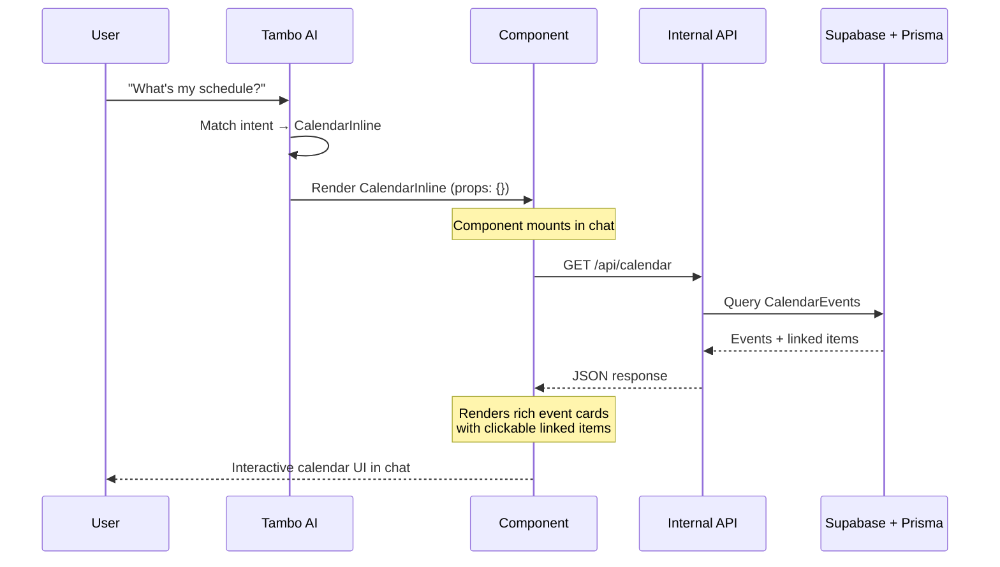
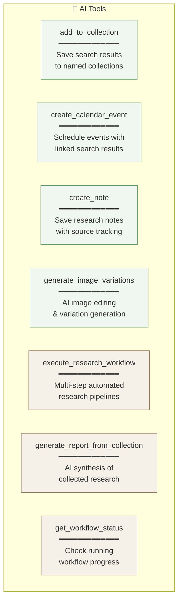
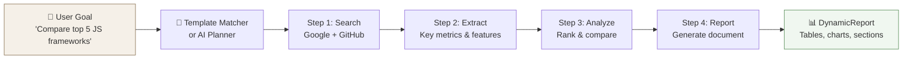
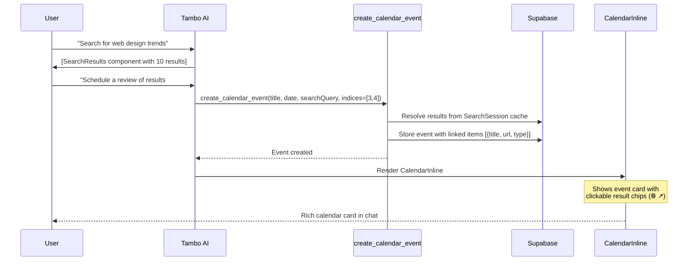
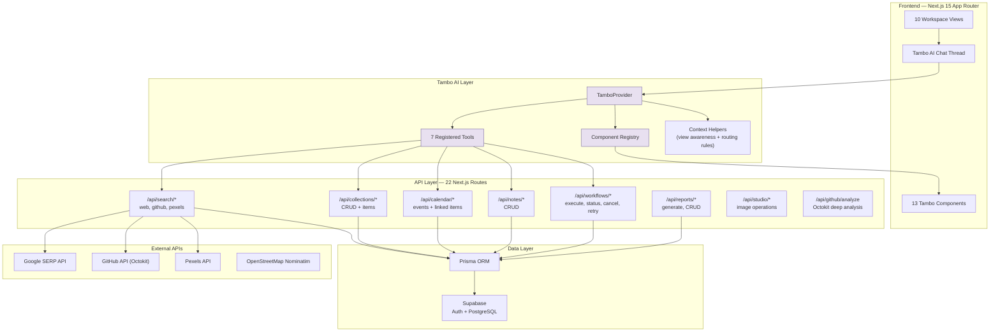
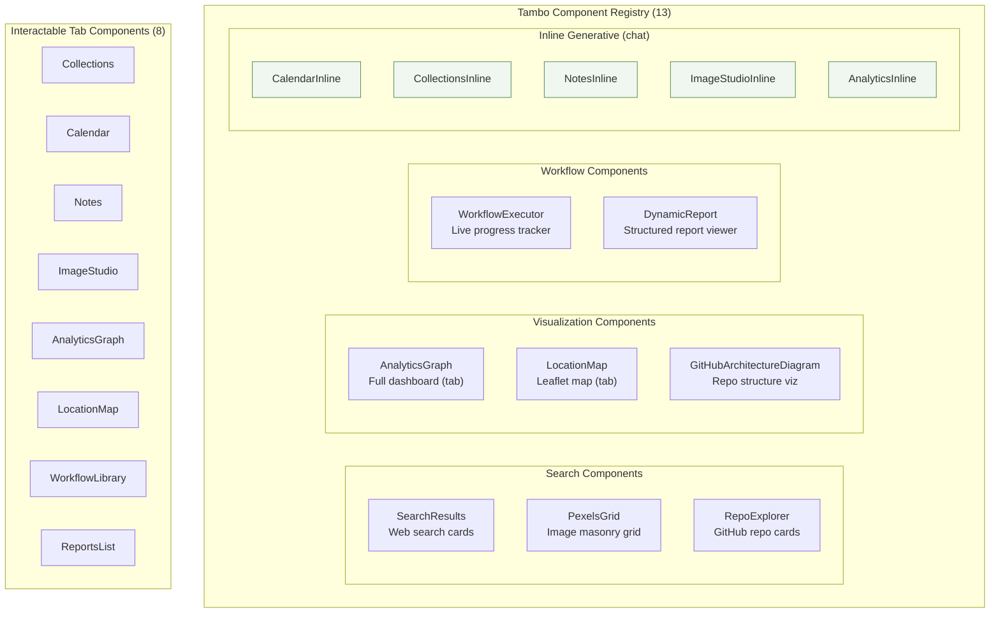
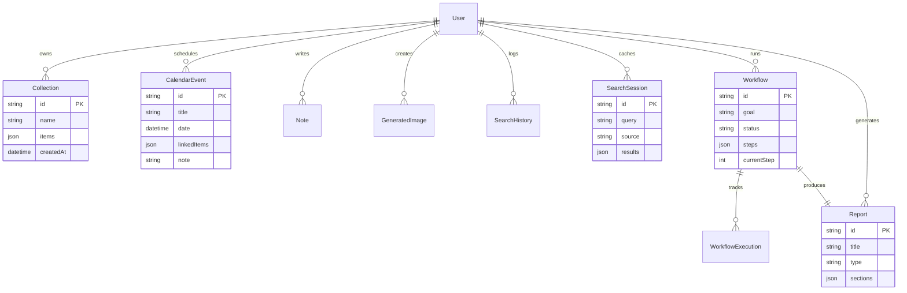

<h1 align="center">Tambo Browser — Search Engine (Tambo Enhanced Perplexity)</h1>

<p align="center">
  <strong>Tambo Browser — Search Engine: A Tambo AI Enhanced Perplexity with Generative, Interactive UI and Fully Managed Workflows</strong>
</p>

<p align="center">
  <a href="#-live-demo">Live Demo</a> •
  <a href="#-the-problem">Problem</a> •
  <a href="#-the-solution">Solution</a> •
  <a href="#-feature-tour">Features</a> •
  <a href="#-architecture">Architecture</a> •
  <a href="#-try-it-yourself">Try It</a> •
  <a href="#%EF%B8%8F-tech-stack">Tech Stack</a>
</p>

<p align="center">
  
  
  
  
  
</p>

---

## 🎯 The Problem

Every AI search and chat tool today — including Perplexity and ChatGPT — has the same core limitation: **the output is always text.**

Ask “Compare React vs Vue on GitHub” and you get a markdown table. Ask “show my schedule” and you get a bullet list. Ask for in-depth analysis and you get… long paragraphs with citations.

**Text is not how humans best consume information.** We need charts, cards, maps, timelines, interactive grids — real, dynamic UI.

## 💡 The Solution

**Tambo Browser** is a fully AI-enhanced search engine and conversational browser that uses [Tambo AI's](https://tambo.co) generative UI framework to render **real, interactive components directly in the chat stream**.

When you ask "Compare React vs Vue vs Svelte on GitHub," you don’t get text — you get a **live bar chart** that auto-fetches GitHub API data and displays stars, forks, and watchers side-by-side.

When you say "Bookmark these results to my Learning Resources collection," the AI calls a tool, saves to your database, and instantly renders your **actual Collections component** inline with clickable links.

This is not just another AI search engine. This is a **Tambo-enhanced Perplexity-style experience** where the AI goes beyond text answers and generates living, interactive UI — orchestrating workspace views, AI tools, generative components, and multi-step workflows — all within a single, seamless conversational interface.

```
┌─────────────────────────────────────────────────────────────────┐
│                                                                 │
│   You:  "Compare React vs Vue vs Svelte on GitHub"             │
│                                                                 │
│   AI:   Pulling live GitHub metrics and charting them.         │
│                                                                 │
│         ┌─────────────────────────────────────────────┐        │
│         │  📊 GitHub Repository Comparison             │        │
│         │  ┌─────────────────────────────────────────┐│        │
│         │  │  ████████████████████  react    228.5k  ││        │
│         │  │  ███████████          vue.js     48.2k  ││        │
│         │  │  ██████████████       svelte     82.1k  ││        │
│         │  │                                         ││        │
│         │  │  Stars ■  Forks ■  Watchers ■           ││        │
│         │  └─────────────────────────────────────────┘│        │
│         │  🟢 react 228k  🟢 vue 48k  🟢 svelte 82k │        │
│         └─────────────────────────────────────────────┘        │
│                                                                 │
│   You:  "Bookmark these and schedule a review"                 │
│                                                                 │
│   AI:   ✅ Saved to "Framework Research" collection.           │
│         ✅ Scheduled review for tomorrow 2:00 PM.              │
│                                                                 │
│         ┌─── 📂 Your Collections ──────────────────┐          │
│         │  Framework Research (3 items)              │          │
│         │  ├── 📄 react — github.com  ↗             │          │
│         │  ├── 📄 vue.js — github.com  ↗            │          │
│         │  └── 📄 svelte — github.com  ↗            │          │
│         └────────────────────────────────────────────┘          │
│                                                                 │
│         ┌─── 📅 Upcoming Schedule ─────────────────┐          │
│         │  FEB  Review Framework Research            │          │
│         │   9   Tomorrow, 2:00 PM                    │          │
│         │       🌐 react — github.com  ↗             │          │
│         │       🌐 vue.js — github.com  ↗            │          │
│         └────────────────────────────────────────────┘          │
│                                                                 │
└─────────────────────────────────────────────────────────────────┘
```

---

## 🚀 Feature Tour

### 10 Workspace Views

Tambo Browser organizes searches and follow-up tasks into specialized workspace views. The AI knows which view you’re on and adapts accordingly.

```
┌──────────────────────────────────────────────────────────────┐
│  SIDEBAR                    │        MAIN WORKSPACE          │
│                             │                                │
│  ▸ CORE                    │    Active view renders here    │
│    🔍 Search               │    with animated transitions   │
│    ⚡ Deep Workflows        │                                │
│    📝 Reports              │    Each view has:              │
│                             │    • Dedicated component       │
│  ▸ VISUALIZE               │    • Floating chat (⌘J)       │
│    📊 Analytics            │    • AI context awareness      │
│    🗺️ Map                  │                                │
│    🎨 Canvas               │                                │
│                             │                                │
│  ▸ ORGANIZE                │                                │
│    📂 Collections          │                                │
│    📅 Calendar             │                                │
│    📝 Notes                │                                │
│    🖼️ Studio               │                                │
│                             │                                │
└──────────────────────────────────────────────────────────────┘
```

| View               | Purpose                           | Component                       | Key Capability                                |
| ------------------ | --------------------------------- | ------------------------------- | --------------------------------------------- |
| **Search**         | Multi-source search               | `MessageThreadFull`             | Google, GitHub, and Pexels search in one chat |
| **Deep Workflows** | Automated multi-step queries      | `WorkflowLibrary`               | 5 templates, live progress, auto-reports      |
| **Reports**        | AI-generated answer documents     | `ReportsList` → `DynamicReport` | Tables, charts, sections, key findings        |
| **Analytics**      | Data visualization dashboard      | `AnalyticsGraph`                | 4 analysis modes with live API data           |
| **Map**            | Location-based queries            | `LocationMap`                   | Leaflet maps with OpenStreetMap Nominatim     |
| **Canvas**         | Spatial multi-component workspace | `CanvasSpace` (Tambo)           | Components stack spatially side-by-side       |
| **Collections**    | Organized bookmarks               | `Collections`                   | Typed items (articles, repos, images, pins)   |
| **Calendar**       | Task scheduling                   | `Calendar`                      | Events with linked search results             |
| **Notes**          | Query annotations                 | `Notes`                         | Source tracking, collection linking           |
| **Studio**         | AI image editing                  | `ImageStudio`                   | Variations, edits, masonry gallery            |

---

### 🧠 Generative UI — The Core Innovation

Traditional AI chat returns text. Tambo Browser returns **living components.**

The key insight: we built **two versions** of every data component — one for the **sidebar tab** (full interactive dashboard) and one for **inline chat** (auto-fetching card that renders just the data).



#### 5 Inline Generative Components

These render **directly in the chat stream** — no tab switching needed:

| Trigger                    | Component           | What Renders                                                           |
| -------------------------- | ------------------- | ---------------------------------------------------------------------- |
| "What's my schedule?"      | `CalendarInline`    | Date pills, event cards, linked search result chips with ↗ links       |
| "Show my collections"      | `CollectionsInline` | Folder cards with typed items (article/repo/image/pin), clickable URLs |
| "Show my notes"            | `NotesInline`       | Note cards with content preview, timestamps, source tags               |
| "Show my studio"           | `ImageStudioInline` | 3-column masonry grid with hover download buttons                      |
| "Compare X vs Y on GitHub" | `AnalyticsInline`   | Auto-fetched bar/pie/line chart with data summary chips                |

#### How It Works Under the Hood



Every inline component:

- **Self-fetches** data on mount (no tool call needed — the AI just renders the component)
- **Shows loading skeletons** (cream-tinted pulse animations) while fetching
- **Supports filtering** via props (e.g., `filterTitle="design"`, `collectionName="Learning Resources"`)
- **Links to full view** ("X more items — switch to Calendar tab to see all")
- **Handles Tambo streaming** with debounced useEffect (waits for props to stabilize before fetching)

---

### 🔧 AI Tool System — 7 Registered Tools

When the user asks the AI to **do something** (not just show data), tools execute real actions:



**Tool → Confirmation Loop:** After every tool execution, the AI renders an inline component to **confirm** the action:

```
User: "Bookmark results #1 and #3 to Learning Resources"
  ↓
AI calls: add_to_collection(name="Learning Resources", indices=[1,3], searchType="web")
  ↓
Tool writes to Supabase via Prisma
  ↓
AI renders: CollectionsInline → shows the saved collection with items
```

---

### ⚡ Workflow Engine — Multi-Step Research Automation

The crown jewel. When simple searches aren't enough, the workflow engine orchestrates **3–8 autonomous research steps**:



#### 5 Pre-Built Templates (Instant, No AI Planning)

| Template             | Trigger Patterns                          | Steps                                      | Sources         |
| -------------------- | ----------------------------------------- | ------------------------------------------ | --------------- |
| **Tech Comparison**  | "compare X vs Y", "best frameworks"       | search → extract → analyze → report        | Google + GitHub |
| **Market Research**  | "market analysis of X", "industry trends" | search → extract → analyze → report        | Google          |
| **Visual Research**  | "find images of X", "photo research"      | search Pexels → curate → report            | Pexels          |
| **GitHub Deep Dive** | "analyze X repo", "GitHub deep dive"      | search GitHub → extract → analyze → report | GitHub          |
| **Trend Timeline**   | "history of X", "evolution of Y"          | search → extract → timeline → report       | Google          |

#### Live Progress Tracking

The `WorkflowExecutor` component renders in-chat with a live progress bar:

```
┌─────────────────────────────────────────────────────────────┐
│  ⚡ JavaScript Frameworks Comparison                        │
│  Compare technologies by GitHub stats and features          │
│                                                             │
│  ██████████████████░░░░░░░░░░ 60% complete                 │
│                                                             │
│  ✅ Step 1: Search web for JavaScript frameworks     done   │
│  ✅ Step 2: Search GitHub repositories               done   │
│  ✅ Step 3: Extract key features & metrics           done   │
│  🔄 Step 4: Compare and rank options               running  │
│  ○  Step 5: Generate comparison report              pending  │
│                                                             │
│  [Cancel]                                    [Retry Step]   │
└─────────────────────────────────────────────────────────────┘
```

When complete, `DynamicReport` renders with structured sections:

```
┌─────────────────────────────────────────────────────────────┐
│  📝 JavaScript Frameworks Comparison Report                 │
│  Generated Feb 8, 2026 • comparison • 5 sections            │
│                                                             │
│  ┌─ Overview ──────────────────────────────────────────┐   │
│  │  React, Vue, and Svelte represent three distinct...  │   │
│  └─────────────────────────────────────────────────────┘   │
│                                                             │
│  ┌─ Comparison Table ──────────────────────────────────┐   │
│  │  Feature    │ React   │ Vue     │ Svelte            │   │
│  │  Stars      │ 228k    │ 48k     │ 82k               │   │
│  │  Bundle     │ 42kb    │ 33kb    │ 1.6kb             │   │
│  └─────────────────────────────────────────────────────┘   │
│                                                             │
│  ┌─ Key Findings ──────────────────────────────────────┐   │
│  │  • React dominates in enterprise adoption           │   │
│  │  • Svelte has the smallest bundle by 20x            │   │
│  │  • Vue offers the gentlest learning curve           │   │
│  └─────────────────────────────────────────────────────┘   │
└─────────────────────────────────────────────────────────────┘
```

---

### 📊 Analytics — 4 Real-Time Analysis Modes

All analytics auto-fetch from **live APIs** (Google Search + GitHub):

| Mode                  | Input                       | Output                                                        | Data Source              |
| --------------------- | --------------------------- | ------------------------------------------------------------- | ------------------------ |
| **GitHub Comparison** | `React, Vue, Svelte`        | Grouped bar chart (stars, forks, watchers)                    | GitHub Search API        |
| **Search Trends**     | `AI startups, ML companies` | Bar chart of result volume                                    | Google SERP API          |
| **Language Trends**   | `machine learning`          | Pie chart of programming languages                            | GitHub repos by language |
| **Source Analysis**   | `cloud computing`           | Bar chart of source types (News, Academic, Blogs, Commercial) | Google SERP domains      |

**Chat trigger:** "Compare React vs Vue on GitHub" → Renders `AnalyticsInline` with a live chart directly in the message thread. No tab switch needed.

**Tab view:** Full `AnalyticsGraph` dashboard with mode selector, input field, and interactive controls.

---

### 🗺️ Map — Location-Based Research

Built with **Leaflet + OpenStreetMap Nominatim** (no API key required):

| Mode              | Example                       | What Renders                          |
| ----------------- | ----------------------------- | ------------------------------------- |
| **Place Search**  | "Find coffee shops in Berlin" | Map markers + place list with ratings |
| **City Explorer** | "Explore landmarks in Paris"  | City-centered map with notable places |
| **Saved Places**  | Geocodes bookmarked items     | Collection items plotted on map       |
| **Route Planner** | "Route from Mumbai to Delhi"  | Two points with connecting line       |

---

### 📅 Calendar — Research Scheduling with Linked Results

The Calendar isn't just a date picker — it **links search results to events**:



Each event shows:

- **Date pills** with month/day
- **Time and notes**
- **Linked search result chips** — clickable, color-coded by type (🌐 web, 🔀 GitHub, 🖼️ image), with external link arrows

---

### 📂 Collections — Smart Bookmarking with Session Cache

Collections use a **session-first lookup** pattern for reliability:

```
User: "Bookmark results #1, #3, #5 to my Learning Resources"
                            ↓
Tool: add_to_collection
  1. Query SearchSession (cached results from this chat)
  2. Resolve items by index → get title, URL, snippet
  3. Create/find collection by name
  4. Store items with type detection (article/repo/image/pin)
                            ↓
AI renders: CollectionsInline → shows saved items with ↗ links
```

**Why session cache matters:** Without it, re-running searches would return different results (search rankings change). The session cache ensures the exact items the user saw are the ones that get bookmarked.

---

## 🏗️ Architecture

### System Overview



### Component Taxonomy



### Database Schema

11 Prisma models powering persistent research state:



---

## 🎮 Try It Yourself — Complete Testing Workflows

### Workflow 1: Search → Bookmark → Schedule → Review

This tests the full research lifecycle across 4 tools and 3 inline components:

```
Step 1  │  "Search for React state management libraries"
        │  → AI renders SearchResults component with 10 web results
        │
Step 2  │  "Bookmark results #1, #3, #5 to State Management Research"
        │  → Tool: add_to_collection → writes to DB
        │  → AI renders CollectionsInline → shows saved items
        │
Step 3  │  "Schedule a deep dive review for tomorrow at 3pm,
        │   link results #1 and #3"
        │  → Tool: create_calendar_event (with searchQuery + indices)
        │  → Resolves items from SearchSession cache
        │  → AI renders CalendarInline → event with clickable chips
        │
Step 4  │  "Save a note: Redux Toolkit seems most popular, Zustand
        │   is gaining fast. Compare both in depth tomorrow."
        │  → Tool: create_note → writes to DB
        │  → AI renders NotesInline → note card with source tag
        │
Step 5  │  "What's my schedule for tomorrow?"
        │  → AI renders CalendarInline → all events for tomorrow
```

### Workflow 2: Analytics — 4 Chat Triggers

Each trigger renders a live chart inline — no tab switch:

```
Trigger 1  │  "Compare React vs Vue vs Svelte on GitHub"
           │  → AnalyticsInline (github-comparison)
           │  → Bar chart: stars, forks, watchers
           │
Trigger 2  │  "Show search trends for AI coding assistants"
           │  → AnalyticsInline (search-trends)
           │  → Bar chart of result volume
           │
Trigger 3  │  "Analyze programming languages for machine learning"
           │  → AnalyticsInline (language-trends)
           │  → Pie chart of languages across ML repos
           │
Trigger 4  │  "Analyze sources for quantum computing"
           │  → AnalyticsInline (source-analysis)
           │  → Bar chart: News, Academic, Blogs, Commercial
```

### Workflow 3: Deep Research Pipeline

End-to-end automated research with live progress:

```
Step 1  │  "Do deep research comparing the top 5 CSS frameworks"
        │  → Tool: execute_research_workflow (depth=standard)
        │  → Template matcher: Tech Comparison (confidence 0.85)
        │  → AI renders WorkflowExecutor with live progress bar
        │
        │  ██████░░░░░░░░░░ Step 2 of 5 — Searching GitHub...
        │
Step 2  │  (Auto) Steps execute sequentially:
        │  → Search Google for CSS framework comparisons
        │  → Search GitHub for CSS framework repos
        │  → Extract key metrics and features
        │  → Analyze and rank by popularity + community health
        │  → Generate comparison report
        │
Step 3  │  Workflow completes → DynamicReport renders inline
        │  → Sections: Overview, Comparison Table, Key Findings
        │
Step 4  │  "Bookmark the key findings to my CSS Research collection"
        │  → Tool: add_to_collection
        │  → CollectionsInline confirms saved items
```

### Workflow 4: Map + Collections Integration

```
Step 1  │  "Find the best coworking spaces in Berlin"
        │  → AI renders SearchResults with web results
        │
Step 2  │  Navigate to Map tab
        │  → LocationMap in Place Search mode
        │  → "Coworking spaces in Berlin"
        │  → Leaflet map with markers + place list
        │
Step 3  │  "Bookmark these to my Berlin Trip collection"
        │  → Tool: add_to_collection
        │  → CollectionsInline shows saved places
```

### Workflow 5: Image Research

```
Step 1  │  "Search for minimalist logo design inspiration on Pexels"
        │  → AI renders PexelsGrid with image masonry grid
        │
Step 2  │  "Generate variations of the first image"
        │  → Tool: generate_image_variations
        │  → AI renders ImageStudioInline with generated variants
        │
Step 3  │  "Save a note about the color palette I liked"
        │  → Tool: create_note
        │  → NotesInline confirms
```

### Quick Smoke Test (7 Prompts)

Run these in sequence to verify everything works:

| #   | Prompt                                  | Expected Result                                  |
| --- | --------------------------------------- | ------------------------------------------------ |
| 1   | "Search for Next.js tutorials"          | `SearchResults` renders with web results         |
| 2   | "Search GitHub for state management"    | `RepoExplorer` renders with repo cards           |
| 3   | "Bookmark result #1 to Dev Resources"   | Tool runs → `CollectionsInline` shows saved item |
| 4   | "Schedule a review for tomorrow at 2pm" | Tool runs → `CalendarInline` shows event         |
| 5   | "Compare React vs Vue on GitHub"        | `AnalyticsInline` renders live chart             |
| 6   | "What's my schedule?"                   | `CalendarInline` renders all events              |
| 7   | "Show my collections"                   | `CollectionsInline` renders all collections      |

### Keyboard Shortcuts

| Shortcut | Action                                          |
| -------- | ----------------------------------------------- |
| `⌘K`     | Open command palette (ControlBar)               |
| `⌘J`     | Toggle floating chat (MessageThreadCollapsible) |

---

## 🏛️ Design System

The entire UI follows a **cream & sage** palette designed for long research sessions:

```
CREAM (backgrounds)                 SAGE (accents)
━━━━━━━━━━━━━━━━━━━                ━━━━━━━━━━━━━━━━━━━
cream-50:  #FEFDFB  (cards)        sage-50:   #F0F7F0  (subtle bg)
cream-100: #FBF9F5  (page bg)      sage-100:  #DCE8DC  (badges)
cream-200: #F5F0E8  (borders)      sage-500:  #5B8F5B  (primary)
cream-300: #E8DFD0  (muted)        sage-600:  #4A7A4A  (hover)
                                    sage-700:  #3D643D  (active)
```

- **Cards:** Rounded-2xl, cream-50 background, cream-200 borders
- **Animations:** `fs-animate-in` (fade+slide), `fs-animate-scale-in` (scale+fade), staggered delays
- **Typography:** Fraunces serif for headings, system sans for body
- **Charts:** Sage-tinted bars/slices with cream data labels
- **Interactive states:** Sage-500 hover borders, sage-50 active backgrounds

---

## 🛠️ Tech Stack

| Layer               | Technology                            | Role                                                   |
| ------------------- | ------------------------------------- | ------------------------------------------------------ |
| **Framework**       | Next.js 15 (App Router)               | SSR, API routes, file-based routing                    |
| **AI UI Framework** | Tambo AI (`@tambo-ai/react`)          | Generative UI, component streaming, tool orchestration |
| **Language**        | TypeScript 5                          | Type safety across 40+ files                           |
| **Auth**            | Supabase Auth                         | OAuth, session management, RLS                         |
| **Database**        | Supabase PostgreSQL                   | Persistent research state                              |
| **ORM**             | Prisma                                | Type-safe database queries, migrations                 |
| **Styling**         | Tailwind CSS + CSS Variables          | Utility-first + custom design system tokens            |
| **Maps**            | Leaflet + react-leaflet               | Interactive maps (SSR-safe with next/dynamic)          |
| **Charts**          | Custom Graph component                | Bar, line, pie charts with sage palette                |
| **Search APIs**     | Google SERP, GitHub (Octokit), Pexels | Multi-source research data                             |
| **Geocoding**       | OpenStreetMap Nominatim               | Free geocoding (no API key)                            |

---

## 📦 Project Structure

```
src/
├── app/
│   ├── page.tsx                      # Main entry → MainWorkspace
│   └── api/                          # 22 API routes
│       ├── search/
│       │   ├── web/route.ts          # Google SERP search
│       │   ├── github/route.ts       # GitHub search (Octokit)
│       │   └── pexels/route.ts       # Pexels image search
│       ├── collections/              # CRUD + items management
│       ├── calendar/                 # Events + linked items
│       ├── notes/                    # CRUD
│       ├── studio/                   # Image operations
│       ├── workflows/                # Execute, status, cancel, retry
│       ├── reports/                  # Generate, CRUD
│       └── github/analyze/           # Deep repo analysis
│
├── components/
│   ├── layout/
│   │   ├── NavigationBar.tsx         # Sidebar + mobile tabs
│   │   └── MainWorkspace.tsx         # View router + context helpers
│   │
│   ├── interactable/                 # Tab view components (8)
│   │   ├── AnalyticsGraph.tsx        # 4-mode dashboard
│   │   ├── Calendar.tsx              # Event management
│   │   ├── Collections.tsx           # Bookmark organizer
│   │   ├── ImageStudio.tsx           # AI image editing
│   │   ├── LocationMap.tsx           # Leaflet maps
│   │   ├── Notes.tsx                 # Research annotations
│   │   ├── ReportsList.tsx           # Report browser
│   │   └── WorkflowLibrary.tsx       # Workflow manager
│   │
│   ├── generative/                   # Inline chat components (5)
│   │   ├── AnalyticsInline.tsx       # Auto-fetch chart
│   │   ├── CalendarInline.tsx        # Event cards
│   │   ├── CollectionsInline.tsx     # Bookmark cards
│   │   ├── ImageStudioInline.tsx     # Image gallery
│   │   └── NotesInline.tsx           # Note cards
│   │
│   └── tambo/                        # Tambo integration
│       ├── control-bar.tsx           # ⌘K command palette
│       ├── message-thread-*.tsx      # Chat UI
│       └── graph.tsx                 # Chart renderer
│
├── lib/
│   ├── tambo.ts                      # Component + tool registry
│   ├── workflow-engine.ts            # Step executor + AI planner
│   ├── workflow-templates.ts         # 5 pre-built templates
│   └── apis/                         # External API wrappers
│
└── prisma/
    └── schema.prisma                 # 11 models
```

---

## ⚙️ Setup

### Prerequisites

- Node.js 18+
- Supabase project (free tier works)
- API keys: Google SERP, GitHub token, Pexels

### Environment Variables

```env
# Supabase
NEXT_PUBLIC_SUPABASE_URL=your_supabase_url
NEXT_PUBLIC_SUPABASE_ANON_KEY=your_anon_key

# Tambo AI
NEXT_PUBLIC_TAMBO_API_KEY=your_tambo_key

# Search APIs
GOOGLE_SERP_API_KEY=your_serp_key
GITHUB_TOKEN=your_github_pat
PEXELS_API_KEY=your_pexels_key

# Database
DATABASE_URL=your_supabase_postgres_url

# App
NEXT_PUBLIC_APP_URL=http://localhost:3000
```

### Install & Run

```bash
git clone https://github.com/your-username/tambo-browser.git
cd tambo-browser
npm install
npx prisma generate
npx prisma db push
npm run dev
```

Open [http://localhost:3000](http://localhost:3000) and start researching.

---

## 🧩 What Makes This Different

| Traditional AI Chat  | Tambo Browser                                            |
| -------------------- | -------------------------------------------------------- |
| Text responses       | Living UI components in the chat stream                  |
| Copy-paste results   | Bookmarks saved to persistent collections                |
| Forget context       | Search sessions cached for reliable bookmarking          |
| Manual tab switching | Inline generative components render data in-place        |
| One search source    | Google + GitHub + Pexels unified                         |
| Single-step answers  | Multi-step workflow engine with live progress            |
| No data persistence  | Full PostgreSQL-backed research state                    |
| Generic UI           | Purpose-built cream/sage design system for long sessions |

---

## 📊 By The Numbers

| Metric                       | Count  |
| ---------------------------- | ------ |
| Tambo-registered components  | **13** |
| Interactable tab components  | **8**  |
| Inline generative components | **5**  |
| AI tools                     | **7**  |
| API routes                   | **22** |
| Workspace views              | **10** |
| Database models              | **11** |
| Workflow templates           | **5**  |
| Analytics modes              | **4**  |
| Map modes                    | **4**  |
| Keyboard shortcuts           | **2**  |

---

## 🏆 Built For

**Tambo AI Hackathon** — Demonstrating what's possible when AI doesn't just generate text, but generates entire interactive interfaces on the fly.

---

<p align="center">
  Built with 🍵 and <a href="https://tambo.co">Tambo AI</a>
</p>
